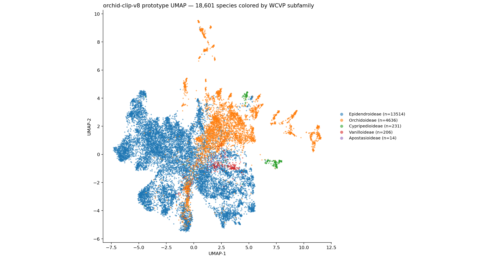

# orchid-clip

[](LICENSE)
[](https://huggingface.co/musharna/orchid-clip-v8)
[](https://huggingface.co/spaces/musharna/orchid-genus-id)

`orchid-clip-v8` is [BioCLIP 2](https://huggingface.co/imageomics/bioclip-2) (ViT-L/14) fine-tuned on orchid (Orchidaceae) photographs, with a sampler that up-weights rare species. This repository holds the inference code, the evaluation and calibration scripts, and the figure generators. The weights are on the Hugging Face Hub.

<p align="center">
  
</p>

Orchid image data are highly imbalanced: a few cultivated genera account for most public images, while many species have fewer than 30 labeled images in the public sources used here.

- Model: [musharna/orchid-clip-v8](https://huggingface.co/musharna/orchid-clip-v8) (MIT), 768-d image and text embeddings
- Demo: [musharna/orchid-genus-id](https://huggingface.co/spaces/musharna/orchid-genus-id) (upload a photo, get a genus, plus a species when the margin is large enough)
- Project page: [musharna.github.io/projects/OrchidCLIP](https://musharna.github.io/projects/OrchidCLIP/)

## Training data

The model was trained on 1.14M images across 5,124 species (at least 3 images per species, after WCVP synonym merging and a cosine-similarity quality filter), using an inverse-square-root class-frequency sampler.

## Results

**Closed-set benchmark.** Each holdout image is ranked (image to text) against the 547 species present in the holdout. The holdout is the first 4,000 images of a 2% hash-partitioned bucket (`md5(source_id)`). It is not stratified or class-balanced, so it keeps the imbalance of the source data.

| model          | top-1 (per image) | top-1 (per genus) | top-5 | genus top-1 |
| -------------- | ----------------- | ----------------- | ----- | ----------- |
| BioCLIP 2      | 0.873             | 0.768             | 0.978 | 0.992       |
| orchid-clip-v8 | 0.911             | 0.844             | 0.986 | 0.991       |

Both columns come from the same run. The per-image gain is +3.8 percentage points (pp), and the per-genus gain is +7.6 pp. The two differ because _Ophrys_ makes up 2,754 of the 4,000 images and gains the least (+2.8 pp), so it dominates the per-image mean but counts once in the per-genus mean. The per-genus column averages over the 14 genera with at least 20 holdout images (3,937 of 4,000 images).

The gains are uneven. The largest are in genera with few holdout images (for example _Lepanthes_ +27.5 pp on 40 images, _Stelis_ +24.0 pp on 25 images), so they are estimated on small samples. Three genera get worse: _Cymbidium_ (−6.0 pp), _Laelia_ (−4.2 pp) and _Encyclia_ (−1.0 pp). Genus accuracy is unchanged (0.992 vs 0.991).

## How the demo decides

This repository's `app.py` and `infer.py` are an earlier, text-embedding version of the Space's logic: a photo's embedding is compared by cosine similarity with text embeddings for 18,858 species names. The live Space now ranks against image centroids.

1. Embed the photo with the v8 image tower (768-d, L2-normalized).
2. Rank species by cosine similarity.
3. If the margin between the top-1 and top-2 scores is at least a threshold τ, show the top species. Otherwise show only the genus ("species uncertain") and list the candidates.

τ was selected on a calibration set of 7,137 images with `eval/calibrate_genus_abstain.py`, which scores against the text embeddings. On that same set, the chosen τ reaches 0.900 shown-species precision at 0.600 coverage. These are in-sample figures, not a held-out guarantee. The live Space reuses the same τ with image-centroid margins.

| metric (text-embedding path, 18,858 candidate species)       | value                |
| ------------------------------------------------------------ | -------------------- |
| species top-1, no abstain (calibration set, n = 7,137)       | 0.71                 |
| shown-species precision with abstain (same set, in-sample)   | 0.90 at 60% coverage |
| genus top-1 on species not seen in training (n = 187 images) | 0.48                 |

## Use it as an embedding

```bash
pip install open_clip_torch huggingface_hub torch pillow
```

```python
import torch, open_clip
from huggingface_hub import snapshot_download
from PIL import Image

ckpt = snapshot_download(
    "musharna/orchid-clip-v8"
)  # model_config.json + open_clip_pytorch_model.bin
model, _, preprocess = open_clip.create_model_and_transforms(
    "ViT-L-14", pretrained=None
)
state = torch.load(
    f"{ckpt}/open_clip_pytorch_model.bin", map_location="cpu", weights_only=False
)
model.load_state_dict(state["state_dict"])
model.eval()  # weights live under state["state_dict"]

img = preprocess(Image.open("orchid.jpg").convert("RGB")).unsqueeze(0)
with torch.no_grad():
    feat = model.encode_image(img)
feat = feat / feat.norm(dim=-1, keepdim=True)  # 768-d, L2-normalized
```

The feature can be ranked against species text embeddings or image centroids, or used for retrieval.

## Repository contents

| path                 | contents                                                                                                                                           |
| -------------------- | -------------------------------------------------------------------------------------------------------------------------------------------------- |
| `orchid_clip/`       | inference package: embedder (`embedder.py`), margin-based species abstain (`abstain.py`), genus rollup (`genus.py`)                               |
| `infer.py`, `app.py` | scoring core and Gradio UI for the earlier text-embedding version of the demo                                                                     |
| `eval/`              | `eval_bioclip_vs_orchid_clip.py` (closed-set and per-genus results), `audit_v7_confusions.py` (confusion pairs), `calibrate_genus_abstain.py` (τ) |
| `viz/`               | Plotly scripts for the project-page figures (risk-coverage, per-genus change, class frequency, prototype UMAP)                                    |

The `eval/` scripts and `app.py` need an image catalog and embedding assets (`assets/v8_text_embeddings.npz`, `genus_abstain.json`, `taxonomy.json`). These come from the training pipeline, which is not included here, so the scripts show the method but cannot be run end to end from this repository alone. The model weights on the Hub can be used without them.

## Limitations

- All results above are on an iNaturalist-dominated holdout. On other field-photo sources, top-1 drops by 0.10 to 0.11. On herbarium specimens and botanical illustrations (IOSPE, POWO), top-1 falls to 0.14 to 0.19 and genus accuracy to about 0.55. Use the model on field photographs.
- Within-genus species identification is the weak point. Several attempts to improve within-genus species accuracy on the model side did not help; adding photos for rare species did.
- Some sister species (e.g. _Cattleya labiata_ / _trianae_ / _warneri_) are hard to tell apart from photographs. This is a research tool, not a substitute for expert or vouchered identification.

## Citation

```bibtex
@software{orchid_clip_2026,
  author = {Arnold, Jaret},
  title  = {orchid-clip: a BioCLIP 2 fine-tune for orchid identification},
  year   = {2026},
  url    = {https://github.com/musharna/orchid-clip},
  note   = {Model: huggingface.co/musharna/orchid-clip-v8}
}
```

## License

MIT, for code and model. Built on [BioCLIP 2](https://huggingface.co/imageomics/bioclip-2) (Imageomics).
