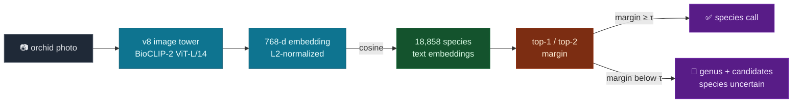

<div align="center">

# 🌿 orchid-clip

[](LICENSE)
[](https://huggingface.co/mjarnold/orchid-clip-v8)
[](https://huggingface.co/spaces/mjarnold/orchid-genus-id)
[](https://musharna.github.io/projects/OrchidCLIP/)
[](https://huggingface.co/imageomics/bioclip-2)


**A long-tail-aware CLIP for fine-grained orchid identification — and an honest map of where fine-grained transfer hits a wall.**

> Genus structure transfers. Within-genus species identity doesn't — six independent attempts, one wall. So instead of guessing a binomial, the live demo serves a **calibrated genus**, and names a species only when the margin earns it.

<p align="center">
  
</p>

</div>

Orchidaceae is one of the largest plant families and one of the most heavily **long-tailed** domains in biological vision: a handful of cultivated genera dominate every public image source, while thousands of tropical-epiphyte species have fewer than 30 labeled images on the entire internet. `orchid-clip-v8` is [BioCLIP 2](https://huggingface.co/imageomics/bioclip-2) (ViT-L/14) fine-tuned to take that tail seriously — and then pushed hard enough to find its limit.

The result is two-sided, and the second half is the interesting one:

1. **It lifts the long tail.** Top-1 climbs from 0.873 (BioCLIP 2) to **0.911**, with the gains landing exactly where they should — the smallest, longest-tailed Pleurothallidinae genera gain **+14 to +28 pp**.
2. **There's a wall.** Across *six* independent extension attempts — a second modality, more capacity, sparse-autoencoder interpretability, open-set recognition, generative augmentation, and a model-free classical-CV control — **genus structure transfers and stays decodable while within-genus species identity hits a wall, every time.** A single failed extension is an anecdote; six, each with its own kill-gate, all landing on the same *genus-survives / species-locked* split, is evidence about the embedding itself.

So the product isn't a species oracle. It's a **calibrated genus card** that abstains from a species call when it hasn't earned one.

## Try it

| | |
| --- | --- |
| 🌿 **Live demo** | **[mjarnold/orchid-genus-id](https://huggingface.co/spaces/mjarnold/orchid-genus-id)** — upload a photo, get a calibrated genus (+ species when confident) |
| 🤗 **Model** | **[mjarnold/orchid-clip-v8](https://huggingface.co/mjarnold/orchid-clip-v8)** (MIT) — frozen ViT-L/14, 768-d embeddings |
| 📄 **Full write-up** | **[musharna.github.io/projects/OrchidCLIP](https://musharna.github.io/projects/OrchidCLIP/)** — the whole story, with interactive figures |

## How the demo decides



The **top-1/top-2 cosine margin** is the confidence signal. A threshold `τ` calibrated on a leakage-safe holdout holds **shown-species precision at ~90%** while still naming a species on **~60%** of photos; below `τ`, the card abstains to *"Genus X (species uncertain)"* and lists the candidate species. Genus is a softmax-then-sum-within-genus rollup over the top candidates — the level the model reliably nails.

## Results

**Closed-set benchmark** — each image ranked (image→text) against the **547** species present in a stratified 4,000-image holdout:

| model          | top-1     | top-5     | genus top-1 |
| -------------- | --------- | --------- | ----------- |
| BioCLIP 2      | 0.873     | 0.978     | 0.992       |
| **orchid-clip-v8** | **0.911** | **0.986** | **0.991**   |

The +3.8 pp top-1 lift comes at no meaningful cost in genus accuracy — these are real *within-genus* species gains, not a coarsened boundary.

**Open-set** — the live demo ranks each photo against **all 18,858** named species, a 34× larger candidate pool. Same cross-modal image→text scoring; the open set is simply harder:

| metric (open-set, the live path)          | value |
| ----------------------------------------- | ----- |
| genus top-1 (nearest species' genus)      | **~0.94** |
| species top-1 (no abstain)                | 0.71  |
| shown-species precision **with abstain**  | **0.90** @ 60% coverage |

## The wall, in one table

Six independent attempts to recover within-genus species identity — different mechanism classes, each with its own kill-gate:

| extension lever                                      | genus | species |
| --------------------------------------------------- | ----- | ------- |
| second modality — herbarium scans / text descriptions | 0.81–0.93 | 0.005 → 0.686, then plateaus |
| more capacity — 2× ViT-H backbone, clade MoE        | —     | no lever found |
| interpretability — sparse autoencoder over features | partial | 0 of 13 morphology axes |
| open-set recognition — reject never-seen species    | holds | novel-rejection 0.155 |
| generative augmentation — synthesize tail species   | —     | no lift past 2–3 real photos |
| model-free control — classical CV, no v8            | (within-photo only) | cross-modal corr ≈ 0 |

It generalizes: this is the fine-grained-taxonomy face of the **modality gap** contrastive image–text models are known to exhibit, and no published herbarium-to-field plant system reports clean within-genus species transfer either. Full account in the [write-up](https://musharna.github.io/projects/OrchidCLIP/#can-the-species-gap-be-closed-six-attempts-one-wall).

## Use it as an embedding

```bash
pip install open_clip_torch huggingface_hub torch pillow
```

```python
import torch, open_clip
from huggingface_hub import snapshot_download
from PIL import Image

ckpt = snapshot_download("mjarnold/orchid-clip-v8")          # model_config.json + open_clip_pytorch_model.bin
model, _, preprocess = open_clip.create_model_and_transforms("ViT-L-14", pretrained=None)
state = torch.load(f"{ckpt}/open_clip_pytorch_model.bin", map_location="cpu", weights_only=False)
model.load_state_dict(state["state_dict"]); model.eval()     # weights live under state["state_dict"]

img = preprocess(Image.open("orchid.jpg").convert("RGB")).unsqueeze(0)
with torch.no_grad():
    feat = model.encode_image(img)
feat = feat / feat.norm(dim=-1, keepdim=True)                # 768-d, L2-normalized
```

That 768-d feature is a foundation embedding — cosine-rank it against species text or image centroids for ID, or use it directly for retrieval and downstream heads (bloom-stage, disease, mounting-style). The model was trained on a **1.14M-image pool across 5,124 species** (≥3 images/species, after WCVP synonym dedup + a cosine quality filter), with an inverse-square-root long-tail sampler.

## What's in here

| path | what |
| --- | --- |
| **`orchid_clip/`** | inference package — unified embedder (`embedder.py`), margin-based species abstain (`abstain.py`), genus rollup (`genus.py`) |
| **`infer.py`**, **`app.py`** | the genus-ID card scoring core + its Gradio UI (the live Space) |
| **`eval/`** | the eval harness — `eval_bioclip_vs_orchid_clip.py` (headline / per-genus), `audit_v7_confusions.py` (confusion structure), `calibrate_genus_abstain.py` (the abstain threshold) |
| **`viz/`** | the four Plotly generators behind the write-up's interactive figures (risk–coverage, per-genus Δ, class-frequency, prototype UMAP) |

> The `eval/` scripts and `app.py` read an upstream image catalog / shipped embedding assets that aren't distributed here — they document methodology and power the live Space, not a turnkey local reproduction. The model itself is fully self-contained on [🤗 Hub](https://huggingface.co/mjarnold/orchid-clip-v8).

## Limitations

Every accuracy here is on an **iNaturalist-dominated** holdout, and v8 inherits that distribution. On other in-situ photo sources it degrades only mildly (−0.10 to −0.11 top-1), but on **botanically-curated archives** heavy with herbarium specimens and illustrations (IOSPE, POWO) it **collapses** — top-1 falls to 0.14–0.19, and even *genus* drops to ~0.55. The within-genus species ceiling is a property of field *photographs*; herbarium and illustration imagery is a separate, larger modality gap. **Deploy on field photos, not scanned plates.**

This is a research artifact, not a substitute for vouchered taxonomy — cryptic sister species (e.g. *Cattleya labiata* / *trianae* / *warneri*) are genuinely conflatable. The abstain is the point, not a bug.

## Citation

```bibtex
@software{orchid_clip_2026,
  author = {Arnold, M.},
  title  = {orchid-clip: a long-tail-aware CLIP for fine-grained orchid identification},
  year   = {2026},
  url    = {https://github.com/musharna/orchid-clip},
  note   = {Model: huggingface.co/mjarnold/orchid-clip-v8}
}
```

## License

MIT — code and model. Built on [BioCLIP 2](https://huggingface.co/imageomics/bioclip-2) (Imageomics).
